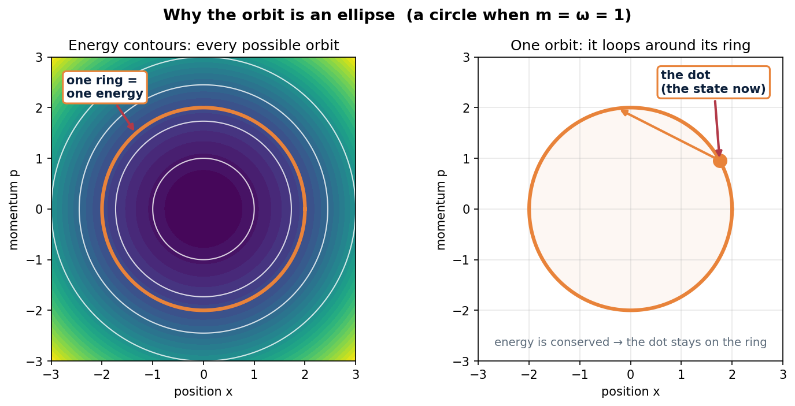

 # Classical & Quantum Mechanics — Study Guide

**Author:** Marcos Sandoval Lucas
**Project:** AI Design of Quantum Processors — Mondragon-Shem Quantum Group, UIC College of Engineering
**Purpose:** Explain the concepts behind Components 1 and 2 from intuition first, then the equation, then a decoding of every symbol — so the *what* and *why* of each computation are clear.

> **How to read this.** Each concept has three layers — **In plain words** (the intuition), **The math** (the equation), and **Decode it** (every symbol explained). The plain-words layer stands on its own if the math is unfamiliar.

> **Conventions & sources.** The quantum notation follows the group's assigned text, **Essler, *Lecture Notes for Quantum Mechanics* (Oxford)** — same Hamiltonian, same ladder operators, same spectrum. Cross-references to Essler's equation and section numbers appear throughout and are collected in **Part 6**. Two notes: Essler writes the operators using a length scale **ℓ = √(ℏ/2mω)** (see §2.5), and Essler does **not** cover the **Wigner function** — that representation comes from the project handout, not the lecture notes (see §2.11). Hardware context (how this oscillator becomes a real qubit) is in **Part 9**, based on the PennyLane superconducting-qubits tutorial.

---

## 0. What the project is (and is not)

The project's direction is sometimes misread as "use quantum computing to make AI run faster." The actual direction is the reverse:

> **Use ordinary (classical) machine learning, running on a normal computer, to predict the properties of quantum hardware — so the expensive quantum calculation need not be run every time.**

The title states it: "AI **Design of** Quantum Processors." AI is the *tool*; the quantum processor is the *thing being studied*.

A common analogy for quantum *computing* — "a normal computer tries each path through a maze one by one, while a quantum computer tries all paths at once" — describes algorithms that exploit superposition. That is a different subject. This project concerns **quantum mechanics / quantum hardware**: the physics of the device itself. The work here is on the *physics-and-data* side, not the *algorithm* side.

**The whole pipeline in one picture:**

```
Component 1            Component 2              Component 3
CLASSICAL  ───────►    QUANTUM       ───────►   MACHINE LEARNING
(the inputs)           (the answers/targets)    (learn the map: inputs → answers)

cheap to compute       expensive to compute     once trained, predicts the
                                                 expensive answer from the
                                                 cheap input
```

The deeper scientific question: **how much about a quantum system can be predicted from classical information alone — and where does that prediction break down?** That breakdown point is where the interesting physics lives.

The **harmonic oscillator** (a mass on a spring) is the test system for one reason: it can be solved **exactly** both classically and quantum-mechanically. That gives an answer key. The project's golden rule — *never trust a numerical result that cannot be checked against an exact formula* — relies on the oscillator always providing that exact formula.

## 0.1 What machine learning is, and where this work fits

**In plain words — what machine learning is.** Normally a computer is told the rule: "if the input is this, give that." Machine learning (ML) flips that around. Instead of writing the rule, you show the computer many **examples** — inputs paired with their correct answers — and it adjusts itself until its guesses match those answers. Once trained, it can take a **new** input it has never seen and predict the answer. The rule is *learned from data*, not hand-written.

**A simple analogy.** Suppose you want to guess a house's price from its size. Collect 500 houses where both the size and the price are known, and draw the line that best fits them. For a new house you then need only the size — read the price off the line. The "learning" was finding that line from the examples. Real ML does the same, but with many inputs at once and far more flexible shapes than a straight line (curves, decision trees, neural networks).

**The two ingredients ML always needs:**
- **Inputs** — the information that is cheap and always available (the house's size).
- **Targets** — the answer you actually want but is expensive to get (the house's price).

ML learns the **map** from inputs to targets.

**Where each component fits.** The whole project is one bet: that an expensive *quantum* property can be predicted from cheap *classical* information. The three components split exactly along the ML ingredients:

| Component | Role in the ML pipeline | The analogy |
|---|---|---|
| **1 — Classical** | generates the **inputs** (phase-space orbits, energies — cheap to compute) | the house's size |
| **2 — Quantum** | generates the **targets** (spectra, dynamics, Wigner functions — expensive) | the house's price |
| **3 — ML** | trains a model on many (input, target) pairs to learn the map | drawing the best-fit line |

Once trained, the model is handed only the cheap classical data and predicts the expensive quantum answer — without re-running the quantum calculation.

**So why all this work before any ML?** A model is only ever as good as the data it is fed. Components 1 and 2 *are* the foundation of the machine learning, even though the learning itself happens later in Component 3 — they build the clean, verified dataset the model cannot work without. This is also why the harmonic oscillator was chosen: its quantum target can be computed **exactly**, so when the model makes a prediction there is a real answer key to grade it against.

**The deeper point.** The science is not "make the model fit." It is to find *where* the prediction starts to fail — because the place classical information can no longer predict the quantum answer is exactly where the genuinely quantum physics lives. (This connects to Part 3 and the central question in §0.)

## 0.2 Where AI fits, and what "predicting the quantum side" really means

**Is "AI" something separate from the machine learning?** No — here they mean the same thing. *Artificial intelligence* is the broad umbrella (any computer doing something that looks intelligent); *machine learning* is the specific branch where the computer learns a rule from examples instead of being handed it. The model trained in Component 3 — the one that learns the map from classical inputs to quantum targets — **is** the "AI" in the project title "AI Design of Quantum Processors." There is no separate AI component; the ML model is it. The honest, specific word for what is being built is *machine learning*.

**The tempting misreading.** It is natural to picture the classical physics itself producing the spectra, dynamics, and Wigner functions. It does **not**. Classical mechanics has no notion of quantized energy levels or of a quasi-probability that can go negative — running Hamilton's equations harder will never output an energy spectrum. The classical equations do not secretly compute the quantum answers.

**What actually produces the prediction.** The **trained model** is the bridge, in three roles:
- The **classical model** (Component 1) supplies the *input features* — cheap orbits and energies.
- The **AI / ML model** (Component 3) supplies the *learned mapping* — the pattern it extracted from data.
- During **training**, it was shown many matched pairs: real classical inputs alongside the real quantum answers from Component 2. It adjusted itself until its outputs matched those answers.

After training, you hand it only the cheap classical data and it *predicts* the quantum quantity — without re-running the expensive quantum calculation. So the precise statement is: **the classical data, passed through a trained model, reproduces the quantum spectra / dynamics / Wigner functions** — not the classical physics alone.

**Why this is science and not a magic trick.** The prediction works only to the extent the classical information actually carries fingerprints of the quantum answer:
- Sometimes it does — a coherent state's average ⟨x̂⟩, ⟨p̂⟩ traces the classical orbit almost exactly (Ehrenfest, §2.10).
- Sometimes it cannot — a Wigner function's **negative** regions are purely quantum (§2.11); there is no classical shadow of them, so a model fed only classical data will struggle to predict them.

Locating exactly where the classical input stops being enough to predict the quantum target is the real discovery. That boundary is where the genuinely quantum physics lives — the same "where does the prediction break down?" question from §0 and Part 3.

---

# PART 1 — Classical Mechanics (Component 1)

**Aim of Component 1:** simulate a mass on a spring and generate clean classical data — the trajectories and energy structure that later become the *inputs* to the machine-learning model.

## 1.1 What a harmonic oscillator is, and why it matters

**In plain words.** A harmonic oscillator is anything that, pushed away from its resting place, feels a force pulling it back — and the harder the push, the harder the pull, *proportionally*. A mass on a spring is the classic example. So is a pendulum for small swings, a guitar string, an electrical circuit, and the building blocks of quantum hardware.

**Why it's everywhere.** Almost any stable system, nudged slightly, behaves like a harmonic oscillator: any smooth "valley" (a stable resting point) looks like a parabola close to its minimum. That is why this one model recurs throughout physics. Mastering it once gives the leading-order behavior of countless systems.

## 1.2 Hooke's Law and Newton's Second Law — the starting point

**In plain words.** Hooke's law says the spring's restoring force is proportional to how far the mass is stretched from center, pointing back toward it. Newton's second law says force causes acceleration. Combined, they give an equation for how the mass moves.

**The math.**

Hooke's law:  `F = -k x`

Newton's second law:  `F = m a = m ẍ`

Combine:  `m ẍ = -k x`  →  `ẍ = -(k/m) x`

**Decode it.**
- `F` = force on the mass (newtons).
- `x` = displacement from the resting (equilibrium) position (meters); `x = 0` is the center.
- `k` = spring constant / stiffness (newtons per meter); a stiffer spring has bigger `k`.
- the minus sign means *restoring*: displacement one way produces force the other way.
- `m` = mass (kilograms).
- `a` = `ẍ` = acceleration = the second time-derivative of position. Dots over a letter mean "rate of change in time": one dot = velocity, two dots = acceleration.

**The clean form.** Defining the **angular frequency** `ω = √(k/m)` gives the standard equation:

`ẍ = -ω² x`

**Decode `ω` (omega):** how fast the oscillator cycles, in radians per second. Bigger `ω` = faster oscillation. The solution is a sine/cosine wave, e.g. `x(t) = A cos(ω t + φ)`, where `A` is the amplitude and `φ` sets the starting point.

## 1.3 Energy: kinetic + potential

**In plain words.** Instead of tracking forces, it is often more useful to track **energy**. The oscillator has two kinds: **kinetic** (energy of motion) and **potential** (energy stored in the stretched spring). In a frictionless oscillator the total never changes — energy trades back and forth. At the turning points all energy is potential (momentarily stopped); at the center all energy is kinetic (moving fastest).

**The math.**

Potential energy:  `V(x) = ½ k x² = ½ m ω² x²`

Kinetic energy:  `T = ½ m v² = p² / (2m)`

**Decode it.**
- `V(x)` = potential energy; a parabola (a valley) centered at `x = 0`.
- `T` = kinetic energy.
- `v` = velocity = `ẋ`.
- `p` = **momentum** = `m v` (mass times velocity) — a key variable.
- Kinetic energy can be written with velocity (`½ m v²`) or with momentum (`p²/2m`). The momentum form is the one quantum mechanics needs, so it is adopted here.

## 1.4 The Hamiltonian and phase space — describing the system by (position, momentum)

**In plain words.** The conceptual upgrade that makes the rest work: describe the oscillator by **position and momentum**, treated as two equal partners, rather than position and velocity. The total energy written in terms of `x` and `p` is the **Hamiltonian**. The 2-D space whose axes are `x` (horizontal) and `p` (vertical) is **phase space**. One point in phase space specifies the entire classical state right now: where it is and how it is moving.

This "position + momentum" picture is the same language quantum mechanics uses, so setting it up now makes Component 2 a translation rather than a new language.

**The math.** Total energy as a function of position and momentum — the Hamiltonian:

`H(x, p) = p²/(2m) + ½ m ω² x²`

**Decode it.**
- `H` = the Hamiltonian = total energy expressed in terms of `x` and `p`.
- First term `p²/(2m)` = kinetic energy.
- Second term `½ m ω² x²` = potential energy.
- `H` stays **constant** in time for a frictionless oscillator — energy conservation.

## 1.5 Why the trajectories are ellipses

**In plain words.** Because total energy `H` stays constant, the point representing the oscillator can only move along a curve of fixed energy. For the harmonic oscillator that curve is an **ellipse** centered on the origin of phase space. The oscillator endlessly circles its ellipse; a bigger ellipse means more energy. Different starting energies give nested, non-crossing ellipses, like the rings of a target.

**The math.** Setting `H(x,p) = E` (a constant):

`p²/(2m) + ½ m ω² x² = E`  →  the equation of an **ellipse** in the `(x, p)` plane.

**Decode it.** `E` is the fixed total energy. Every point on one ellipse has the same `E`, and the oscillator can never jump to a different ellipse (that would change its energy) — energy conservation as a picture. The quantum version (the Wigner function) is a "smeared" version of this picture.

## 1.6 Hamilton's Equations — how the point actually moves

**In plain words.** The ellipse says *where* the oscillator can be; Hamilton's equations say *how it travels* around it — the direction and speed at every point. They replace one second-order equation (acceleration) with two simpler, symmetric first-order equations (rates of change of `x` and `p`).

**The math.**

`ẋ = ∂H/∂p`    and    `ṗ = -∂H/∂x`

For this oscillator, evaluating those derivatives gives:

`ẋ = p/m`    and    `ṗ = -m ω² x`

**Decode it.**
- `ẋ` = how fast position changes = velocity. `ẋ = p/m` says velocity = momentum / mass (recovering `p = mv`).
- `ṗ` = how fast momentum changes. `ṗ = -m ω² x = -k x` is exactly Hooke's law — the force.
- `∂H/∂p` and `∂H/∂x` are **partial derivatives**: "how much `H` changes if only `p` (or only `x`) is nudged," holding the other fixed.
- **Why this form matters for code:** numerical solvers prefer first-order equations. `scipy.integrate.solve_ivp` is built to march exactly this kind of system forward in time, one small step at a time.

## 1.7 What Component 1 computes

**Task 1 — Energy & phase space (the map):**
1. State `E(x,p) = p²/(2m) + ½ m ω² x²`.
2. Derive Hamilton's equations (§1.6) — show the algebra.
3. Make a **contour plot** of `E(x,p)` over a grid of `(x, p)` values, producing nested ellipses, each contour line one energy level. Explain why they are ellipses (constant energy).

**Task 2 — Dynamics & trajectories (the motion):**
1. Use `solve_ivp` to numerically solve `ẋ = p/m`, `ṗ = -mω²x` for one starting point `(x₀, p₀)`. Plot the path in phase space and mark the start.
2. Repeat for many random starting points; plot all trajectories together — nested non-crossing ellipses, bigger ellipse = higher starting energy.

**The point of Task 2:** the answer is known (ellipses), so this validates the numerical pipeline while it can still be checked against the exact result. Later systems lack exact answers, so the code must be trusted here first. The trajectory data (e.g. `.npy` files) becomes ML input later.

**Task 3 — The anharmonic (cosine) oscillator:** *concepts in §1.8.*
1. Add `−V₀cos(kx)` to the potential, so `H = p²/2m + ½mω²x² − V₀cos(kx)`.
2. Re-derive Hamilton's equations. Only one term changes: the force picks up `−V₀k sin(kx)`.
3. Integrate orbits at several energies and overlay them. They stay **closed** but stop being ellipses.
4. Draw a band of initial conditions inside `E_ref ± ΔE`, coloured by energy.

**What to check:** at *small* `x`, `sin(kx) ≈ kx`, so the cosine just stiffens the spring — the
effective frequency becomes `√(ω² + V₀k²/m)`, which is `√2` in natural units, not `ω = 1`. Low-energy
orbits should therefore look near-elliptical, and the deviation should grow with energy. The period
becoming energy-dependent is the signature of anharmonicity, and it is the whole reason a real qubit
is addressable (§1.8, Part 9).

**Task 4 — Two coupled oscillators and Poincaré maps:** *concepts in §1.9.*
1. Couple two cosine oscillators through their **momenta**: `H = Σᵢ[pᵢ²/2m + ½mω²xᵢ² − V₀cos(kxᵢ)] + λp₁p₂`.
2. Derive the four equations of motion. The coupling makes `ẋ₁` depend on `p₂` and vice versa.
3. The phase space is now **4-dimensional** and cannot be drawn, so plot the four 2-D projections.
4. Build **Poincaré maps**: record `(x₁,p₁)` each time the orbit crosses `x₂ = 0` in one direction.
   Launch *several* trajectories per energy — one alone draws a single curve and hides the structure.

**What to check, and the trap I fell into:** it is tempting to read a "scattered-looking" Poincaré
plot as chaos. It is not evidence of anything. The quantitative test is the **Lyapunov exponent**,
and when I measured it my system turned out to be regular at *every* energy — the opposite of what I
had written. §1.9 has the full story, including why the intuition "more energy → more chaos" fails
for a bounded cosine nonlinearity, and what the normal-mode decomposition (Goldstein Ch. 6) reveals
about which term is actually doing the coupling.

**Plotting standards (group):** every axis labeled with units (or "dimensionless"), every curve in the legend, a caption stating the takeaway, and a perceptually uniform colormap (`viridis` / `plasma`).

---

> **Tasks 3 and 4 came later.** The PI's updated handout added them after Tasks 1–2 were done.
> They move the project from the perfect spring toward real hardware: first by bending the spring,
> then by coupling two of them together.

## 1.8 The anharmonic (cosine) oscillator — Task 3

**In plain words.** A perfect spring is *harmonic*: the restoring force grows exactly in proportion to displacement, and every oscillation has the same shape and period regardless of size. A real qubit is not like that. Adding a cosine term, $-V_0\cos(kx)$, makes the force grow *non*-proportionally — the oscillator becomes **anharmonic**. The orbits stay closed loops but deform away from perfect ellipses, and the period now depends on the energy.

**Why it matters.** Anharmonicity is what makes a qubit a *qubit*. In a perfectly harmonic system all energy levels are evenly spaced, so you can't address just two of them. The cosine (from the Josephson junction) spaces the levels unevenly, letting you isolate a single two-level system. Task 3 is the classical shadow of that effect.

## 1.9 Coupled oscillators, Poincaré maps, and chaos — Task 4

**In plain words.** Put two anharmonic oscillators together and let them exchange energy through a coupling term $\lambda p_1 p_2$. Now the motion lives in a **4-dimensional** phase space $(x_1,p_1,x_2,p_2)$, too many dimensions to see at once, so we look at 2-D *projections* and at **Poincaré maps**.

### The four words I need before any of this makes sense

I kept seeing "KAM tori" without knowing what any of it meant. Here is the chain, built up in order.

**1. Integrable = completely predictable.** A system is **integrable** when it has as many conserved
quantities as it has degrees of freedom. Two oscillators that never talk to each other are
integrable: each keeps its own energy forever, so I can solve them separately and write the answer
down. The single harmonic oscillator of Tasks 1–2 is integrable — that is exactly why it has an
exact formula to check against. Integrable systems never behave chaotically.

**2. A torus is where integrable motion lives.** Take those two independent oscillators. Each one
just goes round and round its own loop, so each needs a single **angle** to say where it is in its
cycle. Two angles together describe a **doughnut surface** — a *torus*. Angle one is the position
around the ring, angle two is the position around the tube. The system's state is a point on that
doughnut, winding around in both directions at once. Each starting energy gives its own doughnut,
nested inside the others. That is all "the motion lies on a torus" means.

**3. Incommensurate = the two rhythms never line up.** Two frequencies are **commensurate** if their
ratio is a ratio of small whole numbers — 2:1, 3:2 — and **incommensurate** otherwise. Picture two
runners on a circular track. If one is exactly twice as fast, they meet at the start line every lap:
the combined motion repeats, and the path closes. If the ratio is something like $1:\sqrt2$, they
*never* line up again, and the path winds around the doughnut forever without ever closing. That
never-repeating-but-not-random motion is what **quasiperiodic** means, and it is what a smooth curve
of dots on a Poincaré map is showing me.

**4. The KAM theorem: what happens when you nudge it.** Real systems are not integrable — mine has
the oscillators coupled. So the natural question is whether adding a small coupling destroys all
that orderly doughnut motion. The answer is the **Kolmogorov–Arnold–Moser theorem** (named for the
three mathematicians who proved it in the 1950s–60s; Goldstein §11.2). In his words, if an integrable
system is disturbed by a perturbation, and

  **(a)** the perturbation is *small*, and
  **(b)** the unperturbed frequencies are *incommensurate*,

then the motion **stays on a torus** for all but a negligible set of starting conditions. The
doughnuts survive, slightly bent. They are called **KAM tori** for exactly that reason — the tori
the theorem says will still be there after you nudge the system.

**Why this is a big deal.** It is not obvious. You might reasonably expect any coupling to wreck the
order eventually — and for a *large* coupling it does. KAM says small couplings do not, which is
roughly why the solar system has stayed stable for billions of years despite the planets pulling on
each other.

**Why the two conditions matter to me.** Both are checkable in my own system. Condition (b) failing
is the interesting case: if the two frequencies *are* commensurate, the runners keep meeting at the
same spot, the little pushes from the coupling all add up in the same direction instead of averaging
out, and the torus tears. That is called a **resonance**, and it is where chaos starts. My mode
frequencies work out to a ratio of 1.363 — not close to any small whole-number ratio — so condition
(b) holds and the tori should survive. They do. (I later tested whether hitting an exact resonance
explains the chaos I found at strong coupling; it does not, because by then condition (a) has failed
too. See the end of this section.)

**What a Poincaré map is.** Instead of watching the full continuous motion, record the state only at the instants it crosses a chosen surface (we use $x_2=0$, crossing in one direction). This turns a tangled trajectory into a set of dots — and because the motion lives on a doughnut, slicing through it gives a *closed curve*, which is why regular motion shows up as smooth loops. The pattern of dots reveals the character of the motion:
- **Regular / quasiperiodic motion** → the dots fall on smooth closed curves. Each curve is the slice through one surviving **KAM torus**. The system behaves predictably, almost like two independent oscillators.
- **Chaos** → the dots scatter to fill a 2-D region (a "chaotic sea"), with no clean curve. Tiny changes in the start lead to totally different futures.

**What I actually measured — my intuition was wrong.** I expected raising the energy to drive a transition to chaos. It does not. Using the **maximal Lyapunov exponent** $\lambda_{max}$ (the quantitative test — positive means chaos, zero means regular; Goldstein §11.2–11.6), at my parameters $\lambda=0.3$, $V_0=1$ I get $\lambda_{max}\approx0.004$ at $E=1$, $0.007$ at $E=12$, $0.005$ at $E=30$. All are at the $\log t/t$ convergence floor, which is what zero looks like numerically. **The motion is regular at every energy I tested**, and the Poincaré sections agree — nested curves at both energies, no chaotic sea.

**Why the intuition fails here.** The nonlinearity is a *cosine*, so it is **bounded**: $|V_0\cos(kx)|\le V_0$ however large the energy gets. The harmonic term grows without limit. So raising the energy makes this system *more* nearly harmonic, i.e. closer to integrable — the opposite of the usual picture. The KAM tori survive precisely because the perturbation stays small in the sense the theorem requires.

**Where the chaos actually lives.** Strengthening the *coupling* does it, not raising the energy: at $\lambda=0.8$, $V_0=8$, $E=12$ I measure $\lambda_{max}=0.11$, and at $\lambda=0.8$, $V_0=15$, $E=25$, $\lambda_{max}=0.34$ — both firmly chaotic. So the order-to-chaos transition is controlled by coupling strength and well depth. That regime, not the one I ran, is the natural stress test for classical→quantum prediction.

**The lesson.** A Poincaré plot that "looks scattered" is not evidence of chaos, and one that looks regular is not proof of its absence. Lyapunov exponents are the check; the plot is the picture.

### What the textbooks say to do first: normal modes

Both books point the same way here. Goldstein devotes **Chapter 6** to small oscillations and the
principal-axis transformation, and Griffiths' coupled-oscillator problem carries a footnote saying
plainly: *start with the normal-mode coordinates you would use to decouple the classical problem.*
I had not done that. Doing it turns out to explain the structure of my system exactly.

Rotate by 45°, which is a canonical transformation:
$$X_\pm=\frac{x_1\pm x_2}{\sqrt2},\qquad P_\pm=\frac{p_1\pm p_2}{\sqrt2}.$$

The Hamiltonian becomes

$$H=\frac{P_+^2}{2m_+}+\frac{P_-^2}{2m_-}+\tfrac12 m\omega^2\left(X_+^2+X_-^2\right)-2V_0\cos\!\frac{kX_+}{\sqrt2}\cos\!\frac{kX_-}{\sqrt2},
\qquad \frac{1}{m_\pm}=\frac1m\pm\lambda.$$

I checked this is **exact**, not an approximation — the two forms of `H` agree to 1e-16 on random
phase-space points.

**Three things fall out of it.**

1. **The momentum coupling is not really a coupling.** It is removed entirely by the rotation; all it
   does is give the two modes *different effective masses*. The genuine coupling — the only term that
   makes this system non-integrable — is the **cosine cross-term**. Without the cosine, this problem
   separates into two independent oscillators and is exactly solvable.
2. **The mode frequencies are $\omega_\pm=\omega\sqrt{1\pm\lambda m}$.** Verified numerically to 1e-3. At my
   $\lambda=0.3$ they are 1.140 and 0.837.
3. **KAM's second condition becomes checkable.** Goldstein's statement of the theorem requires the
   unperturbed frequencies to be **incommensurate**. My ratio is $\omega_+/\omega_-=1.363$ — not close to
   any low-order rational — which is consistent with the tori I actually see surviving.

**A hypothesis I tested and rejected.** Those frequency ratios hit exact low-order resonances at
particular couplings: $\lambda=0.6$ gives exactly **2:1** and $\lambda=0.8$ exactly **3:1**. Since
resonance is what breaks KAM, I guessed that was why $\lambda=0.8$ produced chaos. It is not — at
$\lambda=0.5$, which is *off* resonance (ratio 1.732), the Lyapunov exponent is 0.33, just as chaotic.
The explanation is simpler: at the deep well $V_0=8$ the cosine is no longer a *small* perturbation, so
KAM does not apply at all and the frequency condition is beside the point. The resonance structure
would only matter in the near-integrable regime. Worth revisiting at small $V_0$.

---

# PART 2 — Quantum Mechanics (Component 2)

**Aim of Component 2:** compute the *quantum* version of the same oscillator — its allowed energies and how its states evolve — both with exact formulas (the answer key) and with `qutip`. This produces the *target* data the ML model learns to predict.

> **The big mental shift.** Classically, the oscillator is a **point** at a definite `(x, p)`, moving on a definite ellipse. Quantum-mechanically, `x` and `p` can never both be known exactly at once. So the "point" becomes a **fuzzy blob of probability**, and energy is no longer a smooth dial — it comes only in **fixed steps**. The sections below unpack those two changes.

## 2.1 Quantum states are vectors, not points

**In plain words.** A quantum state is not "the particle is here with this momentum." It is an abstract object — written `|ψ⟩` — encoding the *probabilities* of every possible measurement outcome. It can be pictured as a list of amplitudes, one per possibility. A measurement returns one outcome at random, with probabilities set by the state.

**The math & notation.**
- `|ψ⟩` is a "**ket**" — a vector describing the state (Dirac notation; `ψ` is "psi"). The numbers live in **Hilbert space** ("the space of all possible quantum states").
- `⟨φ|` is a "**bra**" — the partner used to ask questions of a state.
- `⟨φ|ψ⟩` is an **inner product** — a single (complex) number measuring "overlap."
- **Born's rule:** the probability of measuring outcome `φ` is `|⟨φ|ψ⟩|²` (the overlap, squared). This connects the abstract math to actual probabilities.
- **Normalization:** `⟨ψ|ψ⟩ = 1`, because total probability is 100%.
- **Superposition:** if `|A⟩` and `|B⟩` are valid states, so is any combination like `(|A⟩ + |B⟩)/√2`. The system is genuinely "both at once" until measured.

## 2.2 Observables become operators

**In plain words.** Classically, position is just a number. Quantum-mechanically, position and momentum become **operators** — machines that act on a state and transform it. The actually-measurable numbers are special values associated with the operator (its "eigenvalues").

**The math.**
- `x̂` = position operator, `p̂` = momentum operator (hats mean "operator," not "number").
- The measurable values of an observable are the **eigenvalues** of its operator. (An eigenvalue is a value `λ` with `Â|v⟩ = λ|v⟩` — the operator acting on a special state just multiplies it by a number. Those `λ`'s are the possible measurement results.)

## 2.3 The uncertainty principle (why the point becomes a blob)

**In plain words.** The single most important quantum fact for this project: position and momentum cannot both be pinned down at once. The more precisely one is known, the fuzzier the other must be. This is built into reality, not a measurement limitation. It is why a quantum oscillator cannot sit perfectly still at the bottom of the valley, and why the phase-space "point" must become a finite-size "blob."

**The math.** Position and momentum operators **do not commute**:

`[x̂, p̂] = x̂ p̂ − p̂ x̂ = iℏ`

**Decode it.**
- `[Â, B̂] = Â B̂ − B̂ Â` is the **commutator** — it measures whether the order of two operations matters. Zero means order is irrelevant (like ordinary numbers); nonzero means order matters.
- Here it is **not** zero — it equals `iℏ`. That nonzero result is the mathematical seed of the uncertainty principle.
- `i` = the imaginary unit (`√−1`). Quantum mechanics genuinely uses complex numbers.
- `ℏ` = the **reduced Planck constant** (`h/2π`), a tiny fundamental constant (~1.05×10⁻³⁴ J·s) setting the "size" of quantum effects. If `ℏ` were zero, quantum mechanics would collapse to classical mechanics.

## 2.4 The quantum Hamiltonian

**In plain words.** Same energy idea as classical (kinetic + potential), now built from operators instead of numbers.

**The math.**

`Ĥ = p̂²/(2m) + ½ m ω² x̂²`

**Decode it.** Identical in form to the classical `H(x,p)` from §1.4, with hats on `x` and `p`. The allowed energies of the oscillator are the **eigenvalues** of `Ĥ`. Finding them is the heart of Component 2, Task 1.

## 2.5 Ladder operators — the clever trick

**In plain words.** Solving for the energies directly involves hard calculus. A slicker route defines two helper operators that **step the system up or down** the energy ladder, one rung at a time. The "raising" operator adds one quantum of energy; the "lowering" operator removes one. With these, the energy structure follows from algebra instead of calculus.

**The math.**
- `â` = **annihilation** (lowering) operator — steps **down** one energy level.
- `â†` = **creation** (raising) operator — steps **up** one level. (`†` is "dagger," the conjugate-transpose.)
- Key relation: `[â, â†] = 1`.
- Position and momentum rebuild from them: `x̂ = √(ℏ/2mω)(â + â†)` and `p̂ = -i√(ℏmω/2)(â − â†)`.
- The Hamiltonian becomes simple: `Ĥ = ℏω(â†â + ½)`.
- `n̂ = â†â` is the **number operator**: it counts how many energy quanta (rungs) the state has.

**Essler's notation (the length scale ℓ).** Essler defines the *same* operators (his eq. 230), packaging the prefactor into a single **characteristic length** `ℓ = √(ℏ/2mω)`, so that `x̂ = ℓ(â + â†)`. This `ℓ` is the natural "size" of the quantum oscillator (roughly the width of its ground-state blob). In **natural units** (ℏ=m=ω=1) it becomes `ℓ = 1/√2`, which is the `1/√2` prefactor in the code. Essler's commutator `[â,â†]=1` is eq. 231, the Hamiltonian `Ĥ=ℏω(â†â+½)` is eq. 233, and the number operator `N̂=â†â` is eq. 234.

**Why it matters.** This is the structure `qutip` uses internally. The command `qutip.destroy(N)` builds `â`; everything else (`â†`, `x̂`, `p̂`, `Ĥ`) is assembled from it. Understanding the ladder is understanding what `qutip` does.

## 2.6 Quantized energy and zero-point energy

**In plain words.** Because the ladder only moves in whole steps, the oscillator's energy is **quantized** — only specific, evenly spaced values are allowed. The lowest rung is **not zero**: even in its calmest state, the quantum oscillator still jitters with a minimum "zero-point" energy. (It must — sitting perfectly still would mean knowing both position and momentum exactly, which the uncertainty principle forbids.)

**The math.** The exact energy spectrum:

`Eₙ = ℏω (n + ½)`,  for  `n = 0, 1, 2, 3, ...`

**Decode it.**
- `n` = the level index (which rung): `n=0` is the ground state, `n=1` the first excited, etc.
- The levels are **evenly spaced**, each `ℏω` apart.
- `n = 0` gives `E₀ = ½ℏω` ≠ 0 — the **zero-point energy**, a pure quantum effect with no classical counterpart (a classical oscillator at rest has exactly zero energy).
- **This formula is the answer key.** In Task 1 the eigenvalues are computed numerically with `qutip` and overlaid on this exact line; they must match for low `n` — the sanity check.
- *Essler reference:* the spectrum `Eₙ=ℏω(n+½)` is eq. 246; the zero-point energy `E₀=½ℏω` is eq. 244; the ladder actions `â|n⟩=√n|n−1⟩`, `â†|n⟩=√(n+1)|n+1⟩` are eqs. 250–251. That the *average* position oscillates at frequency ω is §6.3 ("What oscillates in the quantum harmonic oscillator?"). **Precisely:** because `x̂` connects only *adjacent* levels, the only Bohr frequency it can produce is `(Eₙ₊₁−Eₙ)/ℏ = ω`. So `⟨x̂⟩(t)` either oscillates at exactly ω or is identically zero — never anything else. It vanishes for any state with no adjacent-level coherence: an energy eigenstate `|n⟩`, and also e.g. `(|0⟩+|3⟩)/√2`, which I checked numerically.

## 2.7 Building it in QuTiP (infinite → finite)

**In plain words.** The true quantum oscillator has infinitely many energy levels, but a computer needs finite-size matrices. So the space is **truncated**: keep the lowest `N` levels and represent every operator as an `N×N` matrix. As long as the states stay well below the top rung, the truncation is harmless.

**What Task 1 does:**
- `a = qutip.destroy(N)` builds `â` as an `N×N` matrix.
- `a.dag()` gives `â†`; from these come `x̂`, `p̂`, and `Ĥ`.
- `H.eigenenergies()` returns the numerical eigenvalues — compared to `Eₙ = ℏω(n+½)`.
- `imshow` of the absolute values of the `x̂`, `p̂`, `Ĥ` matrices shows the structure: `Ĥ` is **diagonal** (written in its own energy basis), while `x̂` and `p̂` have entries only just off the diagonal (they connect only neighboring rungs — the ladder at work).

## 2.8 The Schrödinger equation — how quantum states move in time

**In plain words.** This is the quantum analog of Hamilton's equations from Part 1: it gives how a state `|ψ⟩` changes moment to moment. Like Hamilton's equations, it is first-order in time, so a computer can march it forward step by step.

**The math.**

`iℏ d|ψ⟩/dt = Ĥ |ψ(t)⟩`

**Decode it.**
- Left side: how the state changes in time (`d/dt`), scaled by `iℏ`.
- Right side: the Hamiltonian acting on the current state.
- In words: *the energy operator drives the evolution of the state.* The `qutip` function `sesolve` ("Schrödinger Equation solver") does this numerically — the quantum twin of `solve_ivp` from Part 1.

## 2.9 The three states simulated (and what each shows)

Task 2 evolves three specific starting states, each highlighting a different facet of quantumness:

**1. Energy eigenstate (Fock state) `|n⟩` — e.g. `|0⟩` or `|1⟩`.**
*In plain words:* a state of one exact, definite energy. It is **stationary** — its measurable properties do not change in time, and its average position and momentum are zero for all time. The "purely quantum, nothing-classical-about-it" case; its phase-space picture (below) looks nothing like a classical point.

**2. Superposition `(|0⟩ + |1⟩)/√2`.**
*In plain words:* the system is genuinely in *two* energy levels at once. Because the two levels "tick" at different rates, they interfere, and the **average position oscillates back and forth in time** — like a classical pendulum emerging from quantum pieces. Interference made visible.

**3. Coherent state `|α⟩` (a displaced Gaussian blob).**
*In plain words:* the **most classical-like** quantum state. A compact blob that orbits the phase-space origin, holding its shape and tracing the classical orbit **exactly** — for the harmonic oscillator, not merely to a good approximation (see §2.10). The bridge between the quantum and classical pictures, and the most important state for connecting to Component 1.
*Decode `α` (alpha):* a complex number setting where the blob sits and how big its orbit is.
*Essler reference:* coherent states are his **"Aside 4"** (eqs. 281–289). He defines them as eigenstates of the annihilation operator, `â|α⟩=α|α⟩` (eq. 281), shows their wavefunction is a Gaussian centred at position `2ℓα` (eq. 284) — which in natural units is `√2·Re(α)`, exactly where the code places the blob — and proves they keep their shape while orbiting (eq. 289).

## 2.10 Expectation values and Ehrenfest's theorem

**In plain words.** An **expectation value** is the *average* result of many measurements — written `⟨x̂⟩(t)` and `⟨p̂⟩(t)`. Plotting `⟨p̂⟩` vs `⟨x̂⟩` over time gives a phase-space path that lies directly on top of the classical circle from Part 1. For the coherent state in the harmonic oscillator the two agree **exactly** (to solver and truncation error) — this is *Ehrenfest's theorem*.

**What the theorem actually says — and the condition everyone drops.** The usual one-liner is "quantum averages obey classical equations of motion." That is not quite it. Ehrenfest gives (Griffiths eq. 1.38):

$$\frac{d\langle \hat x\rangle}{dt}=\frac{\langle \hat p\rangle}{m},\qquad \frac{d\langle \hat p\rangle}{dt}=\Big\langle -\frac{\partial V}{\partial x}\Big\rangle.$$

The second equation has the average of the **force**, `⟨−∂V/∂x⟩`. The *classical* equation would have the force **evaluated at the average position**, `−∂V/∂x(⟨x⟩)`. Those two are the same thing only when `∂V/∂x` is **linear in x** — which is to say, only for a harmonic potential.

- **Harmonic:** the force is `−mω²x`, perfectly linear, so `⟨−mω²x̂⟩ = −mω²⟨x̂⟩`. The averages follow the classical path *exactly*, for any state and any packet width. That is why Component 2 Task 2 agrees so well.
- **Anharmonic (the fluxonium):** the force is `−(E_Lφ + E_J sin(φ+φ_ext))`, and `⟨sin φ̂⟩ ≠ sin⟨φ̂⟩`. The averages now obey *no* classical equation. A quick check with a coherent state in `V = x²/2 + 0.1x⁴` gives `⟨−dV/dx⟩ = −7.21` against `−dV/dx(⟨x⟩) = −5.94` — a 21% discrepancy from one quartic term.

**This is the whole explanation for my Component 2 Task 3 result.** The fluxonium packet does not lag the classical trajectory because of numerical error or because the packet is "spread out" in some vague sense — it lags because Ehrenfest's theorem *stops applying* the moment the potential is anharmonic, and the size of the failure grows with both the anharmonicity and the packet width. Since `φ_zpf = 1.41` is comparable to the width of the well, the packet samples a lot of curvature and the failure is large. The same statement explains why Component 3 has anything to learn at all: the MLP is being asked to model exactly the term that Ehrenfest throws away.

**The catch (Task 2d).** Collapsing the whole fuzzy blob to a single average point **throws away** most of the quantum information — the spread, the uncertainty, the interference. The average looks classical precisely *because* averaging hides the quantum richness. Keeping that richness requires the Wigner function (next).

*Essler reference:* Ehrenfest's theorem is derived in **§4.1**. The related result — that ⟨x̂⟩(t) oscillates at frequency ω whenever it is non-zero at all — is **§6.3**, using the position matrix element `⟨m|x̂|n⟩ = ℓ(√n δ_{m,n−1} + √(n+1) δ_{m,n+1})` (eq. 276) — precisely the off-diagonal "next-neighbor only" pattern seen in the `x̂` matrix image.

## 2.11 The Wigner function — the quantum picture in phase space

**In plain words.** This is the centerpiece of Component 2 and the bridge to the ML work. The uncertainty principle forbids an honest joint probability for exact `(x, p)`. The Wigner function `W(x, p)` is the closest legal substitute: a "**quasi-probability**" map over the same `(x, p)` plane used classically. It lets a quantum state be drawn in phase space and compared directly to the classical ellipse.

The telltale feature: **the Wigner function can go negative.** A real probability can never be negative. So wherever `W(x,p) < 0`, the state has **no classical explanation**. Negativity is the fingerprint of "genuinely quantum."

> **Note on sources.** The Wigner function is **not** in Essler's lecture notes — Essler instead compares quantum and classical oscillators using the *position* probability density `|ψₙ(x)|²` (his §6.4, the n=100 figure). The Wigner phase-space representation used here comes from the **project handout/roadmap** (and QuTiP's `wigner` function). Both are valid windows on the same physics; the Wigner picture is used because it lives in the same `(x,p)` plane as the classical data, which is what Component 3's ML needs.

**What each state looks like:**
- **Coherent state:** a single positive Gaussian bump, offset from the origin. **No negative regions** → the most classical state. It orbits the origin holding its shape.
- **Fock state `|n⟩`:** concentric rings. Going outward from the origin the sign flips `n` times, and the centre alternates as `W(0,0) ∝ (−1)ⁿ` — so `|1⟩` has a negative crater at the middle, `|2⟩` is positive at the middle with a negative ring around it. (The count of *negative regions* is therefore ⌈n/2⌉, not `n` — I had that wrong at first; see Part 5.) Strongly non-classical either way: a classical particle of fixed energy is a thin ring, the quantum Fock state is a smeared, ringed crater.
- **Superposition:** two bumps plus a stripey pattern of **alternating positive/negative interference fringes** in between — proof of a true superposition, not a random mixture.

**A special property of the harmonic oscillator (checked numerically):** its Wigner function evolves in time by simply **rotating rigidly** around the origin. I verified this — evolving a lumpy asymmetric state for a quarter period and rotating the initial Wigner function by 90° give the *same array to numerical precision*, and after a full period the state returns to itself to 1e-6. The rotation — exactly mirroring the classical flow around the ellipse, with no distortion. (This is special to the quadratic potential; most systems get messy. Another reason the oscillator is the ideal teaching system.)

**What Task 2 does:** use `sesolve` to evolve each state, `qutip.wigner` to compute `W(x,p)` on a grid, plot snapshots, and animate movies with a **fixed color scale** (so negative regions stay visible), using a diverging colormap like `RdBu` to contrast positive vs negative. Overlay `⟨p̂⟩` vs `⟨x̂⟩` on the classical ellipse for Task 2d.

---

> **Task 3 came later too**, from the same updated handout. Tasks 1–2 above are the textbook
> oscillator, where every number has an exact formula to check against. Task 3 spends that
> confidence on a real superconducting qubit, which has no closed-form answer.

## 2.12 The fluxonium qubit — Task 3

**In plain words.** The **fluxonium** is a real superconducting qubit: a Josephson junction shunted by a large inductor. Its quantum Hamiltonian,
$$\hat H = 4E_C\,\hat n^2 + \tfrac12 E_L\hat\varphi^2 - E_J\cos(\hat\varphi+\varphi_{ext}),$$
is the exact quantum version of the classical cosine oscillator from Task 3. The variables are **phase** $\hat\varphi$ (like position) and **charge** $\hat n$ (like momentum) — they are conjugate, so the same uncertainty principle applies.

**Which coordinate — the one trap I fell into.** `scqubits` writes the potential as
$$U(\varphi)=\tfrac12 E_L\varphi^2 - E_J\cos(\varphi+\varphi_{ext}),$$
with the *inductive* term centred on $\varphi=0$. At half flux that puts the two wells at $\varphi\approx\pm2.85$ and makes **$\varphi=0$ the top of the barrier**. The same physics can be written $\tfrac12 E_L(\varphi-\varphi_{ext})^2 - E_J\cos\varphi$, which moves the wells to $0.29$ and $5.99$ — but that is a *different coordinate*, shifted by $\varphi_{ext}$. If I use one form for the classical trajectory and let `scqubits` use the other for the quantum state, the two are half a flux quantum apart and every comparison between them is meaningless. Rule: always take the potential from `fluxonium.potential(...)` and integrate the classical equations in that same $\varphi$.

**A caveat on "quantum twin".** At **zero** flux $U=\tfrac12 E_L\varphi^2-E_J\cos\varphi$, exactly the cosine oscillator of Component 1 Task 3 with $V_0=E_J$. At **half** flux the cosine flips sign ($\cos(\varphi+\pi)=-\cos\varphi$), so the fluxonium becomes $\tfrac12 E_L\varphi^2+E_J\cos\varphi$ — a double well, where Task 3's single-well oscillator is not. The two tasks are the same *family*, not the same system.

**The double well and tunneling.** At the half-flux "sweet spot" ($\varphi_{ext}=\pi$) the potential is a symmetric **double well**. The two lowest states form a near-degenerate pair (one symmetric, one antisymmetric across the barrier) — the signature of **quantum tunneling** between the wells, something with no classical analogue.

**Wave packets.** We build a Gaussian **wave packet** (a coherent state) localized at a phase $\varphi_0$ and evolve it with the Schrödinger equation. Comparing its averages $\langle\hat\varphi\rangle(t),\langle\hat n\rangle(t)$ to the classical trajectory shows where the two agree (near a well bottom, where the potential is closest to harmonic) and where they diverge (up the wall and at the barrier, where it is least harmonic).

**Why they diverge — the precise reason.** Not "the packet spreads," which is vague. Ehrenfest's theorem (§2.10) gives $d\langle\hat n\rangle/dt=\langle-\partial U/\partial\varphi\rangle$, and for this potential $\langle\sin\hat\varphi\rangle\neq\sin\langle\hat\varphi\rangle$. The averages therefore obey no classical equation of motion at all; the gap is the difference between those two quantities, and it grows with the anharmonicity and with how much of the potential's curvature the packet samples. With $\varphi_{zpf}=1.41$ against a well only a few radians wide, the packet samples a great deal of curvature, so the gap is large everywhere in this parameter regime — which is exactly what Component 3 measures (RMS $0.84\to1.19$ rad).

---

# PART 3 — How it all connects

The full arc:

- **Component 1 (classical)** gives the cheap, easy-to-compute side: energy contours and trajectories in phase space. These become the **inputs** to the ML model.
- **Component 2 (quantum)** gives the expensive, hard-to-compute side: energy spectra, state dynamics, and especially **Wigner functions** — which conveniently live in the *same* `(x, p)` picture as the classical data. These become the **targets** the ML model predicts.
- **Component 3 (ML)** trains a model to learn the map from classical inputs → quantum targets. If it works, expensive quantum properties can be predicted from cheap classical data — a real tool for designing quantum processors, because full quantum simulation does not scale.

So the role of this work: generate trustworthy data on *both* sides of the classical–quantum divide, understand exactly where the two pictures agree and where they part ways, and use that to teach a machine to predict the quantum side from the classical side. The science is not just "make the model fit" — it is discovering **how far classical information can reach into the quantum world before it fails.**

The Wigner function is what makes this plausible: it forces quantum states into the same phase-space language as classical states, so a machine can compare them feature-for-feature.


## 3.1 Why the later tasks tie back to the goal

Component 3's model learns to predict the fluxonium's quantum trajectory from the classical one. Tasks 3 and 4 build the *classical* inputs (anharmonic, possibly chaotic) and Task 3 of Component 2 builds the *quantum* targets (with tunneling). The scientific payoff is locating **where** the classical input stops predicting the quantum output — near barriers, in chaotic regions — because that boundary is where the genuinely quantum physics lives. For the machine-learning side of getting closer to this goal, see `reference/Research_ClassicalToQuantum_ML.md`.

---

*Suggested entry point: Component 1, Task 1 — plot the energy contours and confirm nested ellipses. That single plot anchors the rest of this guide.*

---

# PART 4 — Component 3: the neural network (MLP), in plain words

Components 1 and 2 build the data; Component 3 builds the **model** that learns from it. §0.1 explained what machine learning is in general; this part explains the specific model the professor's Task 1 asks for.

## What kind of model — a multilayer perceptron (MLP)

**In plain words.** An MLP is the simplest kind of neural network: a stack of layers, where each layer multiplies its input by a table of adjustable numbers (weights), adds an offset, and then bends the result through a simple non-linear kink. Stacking these lets the network turn straight-line relationships into flexible curves, so it can approximate almost any input→output map if given enough examples.

**The pieces (decode the jargon):**
- **Layer / `Linear`.** One "multiply by weights and add a bias" step: `output = W·input + b`. `W` and `b` are the numbers the training adjusts.
- **ReLU** (*rectified linear unit*). The non-linear kink applied between layers: it keeps positive values and sets negative ones to zero (`ReLU(z) = max(0, z)`). Without a non-linearity, stacking layers would just collapse back into one straight line — ReLU is what lets the network bend.
- **Hidden layer.** Any layer between the input and the final output. This task uses **two** hidden layers, each of width `d_h` (e.g. 128 numbers wide).
- **Weights (parameters).** All the `W`s and `b`s together — the knobs training turns. "Training the model" = finding good values for these.

For Task 1 the network is `A → hidden layer (ReLU) → hidden layer (ReLU) → B̂`.

## What it is predicting — regression, not classification

**In plain words.** There are two flavors of supervised learning: *classification* (pick a category — cat vs dog) and **regression** (predict continuous numbers). This task is regression: the input `A` is a whole classical trajectory written as a list of `2·N_t` numbers `[x(t₁…), p(t₁…)]`, and the target `B` is the matching quantum trajectory `[⟨x⟩(t₁…), ⟨p⟩(t₁…)]`, also `2·N_t` numbers. The network reads one vector and predicts another vector — a *vector-to-vector* map `f(A) ≈ B`.

## How it learns — loss, optimizer, epochs, batches

**In plain words.** Learning is just "guess, measure how wrong, nudge the weights to be less wrong, repeat."
- **Loss — MSE (mean squared error).** The score of wrongness: take the prediction `B̂`, subtract the true `B`, square the differences, average them. Zero means perfect; training tries to make this small.
- **Optimizer — Adam.** The rule that decides how to nudge each weight to reduce the loss. Adam is a popular, well-behaved default. The **learning rate** sets how big each nudge is.
- **Epoch.** One full pass through all the training examples. Training runs many epochs (e.g. 150).
- **Mini-batch.** Rather than use all examples at once, the data is fed in small groups (e.g. 32 at a time); each group gives one weight update. This is faster and helps learning.

## How we know it actually learned — the train/validation split

**In plain words.** The data is split **80% training / 20% validation**. The network only *learns* from the training 80%; the validation 20% is held back as an honesty check — unseen data used only to measure performance. If the training loss keeps dropping but the validation loss starts *rising*, the model is **overfitting**: memorizing the training examples instead of learning the general rule. Success looks like **both** losses falling and then leveling off together.

**Early stopping, and how to read the gap.** The epoch where the validation loss bottoms out is the last epoch that bought any real generalization; training past it only tightens the fit to the training rows. Stopping there is called **early stopping**, and it is the most useful thing the validation curve tells me.

A gap between the two curves is not by itself a problem — the training loss is *always* lower, because those are the rows the network was fitted on. The question is only whether the **validation** curve is still going down. While it is, keep training. When it flattens or turns up while the training curve keeps falling, the extra epochs are pure memorization, and I should cut the epochs (or shrink the network, or generate more samples).

Two things follow. First, the number I quote is the **best validation MSE**, never the final training MSE — the notebook prints both, plus the epoch the best one happened at. Second, more training data moves this a lot: raising `N_s` gave a noticeably lower validation error and kept it falling for far longer than a smaller run did.

One practical step: the inputs and targets are **standardized** (shifted and rescaled to roughly zero mean, unit spread) before training, purely so the optimizer converges smoothly; predictions are converted back to physical units for plotting.

## How this maps onto the fluxonium task

The classical input `A` comes from the **classical** cosine oscillator (Component 1, Task 3); the quantum target `B` comes from the **fluxonium** quantum simulation (Component 2, Task 3). Both use the *same* mapped parameters so each classical trajectory has a genuine quantum partner. Train the MLP on many such `(A, B)` pairs and it learns to predict the quantum motion from the cheap classical motion.

> **Status note.** `component3_ml.ipynb` implements this whole pipeline on **real data** — the placeholder is gone. Component 2 Task 3 is built, so the quantum targets are genuine fluxonium `sesolve` trajectories: `scqubits` supplies the Hamiltonian, QuTiP evolves each Gaussian packet, and the classical inputs are the matching nonlinear-oscillator runs started from the same initial conditions.

**Why it matters.** This is where the project's central question finally gets tested: *how far can cheap classical information predict expensive quantum behavior, and where does it break down?* The validation error, and where it grows, is the quantitative answer.

---

# PART 5 — Symbol glossary (quick reference)

**Classical-chaos vocabulary (Task 4, §1.9):**

| Term | In one line |
|---|---|
| **Integrable** | As many conserved quantities as degrees of freedom — completely predictable, never chaotic. Two uncoupled oscillators are integrable. |
| **Torus** | A doughnut surface. Two independent oscillations need two angles to locate, and two angles = a point on a doughnut. Integrable motion winds around one. |
| **Quasiperiodic** | Motion that never exactly repeats but is not random — it winds the torus forever. Shows up as a smooth closed curve of dots on a Poincaré map. |
| **Commensurate / incommensurate** | Two frequencies whose ratio *is* / *is not* a ratio of small whole numbers. 2:1 is commensurate; 1:√2 is not. |
| **Resonance** | A commensurate frequency ratio. The coupling's small pushes stop averaging out and add up instead, which is what tears a torus. |
| **KAM theorem** | Kolmogorov–Arnold–Moser: nudge an integrable system with a *small* perturbation, and if its frequencies are incommensurate, most tori survive. Hence "KAM tori". |
| **Lyapunov exponent λ_max** | How fast two nearby trajectories separate. Positive = chaos; zero = regular. The actual *test*, as opposed to eyeballing a plot. |
| **Chaotic sea** | A region of the Poincaré map filled with scattered dots lying on no curve — where the tori have been destroyed. |


| Symbol | Name | Plain meaning |
|---|---|---|
| `x` | position | where the mass is (m) |
| `p` | momentum | mass × velocity; "how much motion" (kg·m/s) |
| `v`, `ẋ` | velocity | rate of change of position |
| `ẍ` | acceleration | rate of change of velocity |
| `m` | mass | how heavy (kg) |
| `k` | spring constant | stiffness (N/m) |
| `ω` (omega) | angular frequency | how fast it cycles; `ω=√(k/m)` (rad/s) |
| `E` | energy | total energy (J) |
| `V(x)` | potential energy | energy stored in the spring |
| `T` | kinetic energy | energy of motion |
| `H`, `Ĥ` | Hamiltonian | total energy as a function of `x,p` (hat = operator) |
| `∂H/∂x` | partial derivative | how `H` changes if only `x` moves |
| `|ψ⟩` | ket (state) | the full quantum state ("psi") |
| `⟨φ\|ψ⟩` | inner product | overlap between two states (a number) |
| `\|⟨φ\|ψ⟩\|²` | Born rule | probability of measuring outcome `φ` |
| `x̂`, `p̂` | operators | position/momentum as quantum operators |
| `[Â,B̂]` | commutator | `ÂB̂−B̂Â`; nonzero ⇒ order matters |
| `ℏ` (h-bar) | reduced Planck constant | sets the scale of quantum effects |
| `i` | imaginary unit | `√−1` |
| `â`, `â†` | ladder operators | lower / raise energy by one rung |
| `n̂` | number operator | counts energy quanta |
| `\|n⟩` | Fock state | state of exactly `n` quanta (definite energy) |
| `\|α⟩` | coherent state | most classical-like blob ("alpha") |
| `Eₙ` | energy spectrum | `ℏω(n+½)`; the allowed energies |
| `⟨x̂⟩(t)` | expectation value | average position over time |
| `W(x,p)` | Wigner function | quantum state drawn in phase space (can be negative) |
| `ℓ` | length scale | `√(ℏ/2mω)`; Essler's prefactor, `=1/√2` in natural units |

---

# PART 6 — Sanity checks (the golden rule in practice)

Always verify numbers against exact formulas. The oscillator has these checks built in:

1. **Energy spectrum:** numerical eigenvalues from `qutip` must equal `Eₙ = ℏω(n+½)` for low `n`. Drift at high `n` means the truncation `N` is too small.
2. **Ground state energy:** the lowest eigenvalue must be `½ℏω`, never zero.
3. **Even spacing:** consecutive energy levels differ by exactly `ℏω`.
4. **Classical limit:** the coherent state's `⟨x̂⟩,⟨p̂⟩` must trace the classical orbit — a circle in natural units, an ellipse in general ones (Ehrenfest). For the *harmonic* oscillator this should be exact, not approximate; a visible gap means the dynamics are off.
5. **Wigner sign:** the coherent state stays positive everywhere. The Fock state `|n⟩` has **`n` sign changes** going outward from the origin, and the centre alternates as `W(0,0) ∝ (−1)ⁿ` — so `|0⟩` is positive at the centre, `|1⟩` has a negative crater, `|2⟩` is positive again with a negative ring around it. (Counting *negative regions* rather than sign changes gives ⌈n/2⌉, not `n` — I had this wrong at first.) A `|1⟩` with no negative region signals a problem.
6. **Classical trajectories:** `solve_ivp` ellipses must be closed, non-crossing, and at constant energy. Drifting energy means the solver tolerance needs tightening.

---

# PART 7 — Cross-reference map to Essler's *Lecture Notes for Quantum Mechanics*

The assigned text uses the **same conventions** as this guide and the notebooks. This table maps each concept to where Essler derives it. **Part 8** does the same for Griffiths, the book Prof. Mondragon-Shem recommended, and gives an ordered reading path through it.

| Concept | This guide | Essler notes |
|---|---|---|
| Quantum Hamiltonian `Ĥ = p̂²/2m + ½mω²x̂²` | §2.4 | eq. 228 |
| Creation/annihilation operators (with length scale `ℓ=√(ℏ/2mω)`) | §2.5 | eq. 230 |
| Commutator `[â,â†]=1` | §2.5 | eq. 231 |
| `Ĥ = ℏω(â†â+½)`, number operator `N̂=â†â` | §2.5 | eqs. 233–234 |
| Zero-point energy `E₀=½ℏω` | §2.6 | eq. 244 |
| Energy spectrum `Eₙ=ℏω(n+½)` | §2.6 | eq. 246 |
| Ladder actions `â|n⟩=√n|n−1⟩`, `â†|n⟩=√(n+1)|n+1⟩` | §2.5 | eqs. 250–251 |
| Position matrix element `⟨m|x̂|n⟩=ℓ(√n δ_{m,n−1}+√(n+1)δ_{m,n+1})` | §2.10 | eq. 276 |
| Why `⟨x̂⟩(t)` oscillates at ω (or vanishes) | §2.6, §2.10 | §6.3 |
| Coherent states `â|α⟩=α|α⟩`, Gaussian at `2ℓα` | §2.9, §2.10 | Aside 4 (eqs. 281–289) |
| Ehrenfest's theorem (averages obey classical motion) | §2.10 | §4.1 |
| Heisenberg uncertainty, minimal-uncertainty ground state | §2.3 | §3.2, eqs. 259–261 |
| Quantum vs. classical (Essler uses `|ψₙ(x)|²`; here, Wigner) | §2.11 | §6.4 |
| **Wigner function** | §2.11 | *not in Essler* — from the project handout |

**The one notation difference:** Essler's `ℓ = √(ℏ/2mω)` is the constant in front of the ladder operators. In natural units (ℏ=m=ω=1) it equals `1/√2`, the `1/np.sqrt(2)` in the code. So `x̂ = ℓ(â+â†)` (Essler) and `x̂ = (â+â†)/√2` (code) are the same equation.

---

> **See also.** `Findings_and_Corrections.md` in this folder records the two errors found during
> the July review — the fluxonium coordinate convention and the chaos claim — and how each was caught.

# PART 8 — Reading path through Griffiths

**The book:** Griffiths & Schroeter, *Introduction to Quantum Mechanics*, **3rd edition** (Cambridge).
Recommended by Prof. Mondragon-Shem. Essler is the group's assigned text and is terser; Griffiths is
the one to actually *learn* from, then use Essler for the group's exact conventions.

**How the two differ.** Essler goes straight to ladder operators and stays algebraic. Griffiths
builds up from the wave function and the Schrödinger equation first, so the formalism arrives with
motivation attached. For someone new to the subject, read Griffiths for understanding and Essler for
notation.

## The path, in order

Section numbers are 3rd-edition. Difficulty is my honest estimate of a *first* pass.

**Stage 1 — before anything else (Chapter 1, ~a week).**
- **1.1 The Schrödinger Equation**, **1.2 The Statistical Interpretation** — what the wave function
  actually *is*. This is the conceptual hurdle, not the maths. `readable`
- **1.3 Probability**, **1.4 Normalization**, **1.5 Momentum** — where expectation values come from.
  Read closely: `⟨x̂⟩` and `⟨p̂⟩` are exactly what Component 2 plots. `readable`
- **1.6 The Uncertainty Principle** — why the classical point becomes a blob. `readable`
- **Ehrenfest's theorem is Equation 1.38.** This is the single most relevant result in Chapter 1 for
  this project: it is why the coherent state's average traces the classical orbit.

**Stage 2 — the oscillator itself (Chapter 2).**
- **2.1 Stationary States**, **2.2 The Infinite Square Well** — warm-up, and the square well is the
  cleanest example of quantised levels. `readable`
- **2.3.1 The Harmonic Oscillator, Algebraic Method** (pp. ~41–47) — **the most important section in
  the book for this project.** Ladder operators, `Ĥ = ℏω(â†â + ½)`, the spectrum, the zero-point
  energy. This is line-for-line what `component2_quantum.ipynb` Task 1 builds. `readable, do it properly`
- **2.3.2 Analytic Method** — the same answers via Hermite polynomials and a power-series solution.
  Mathematically heavy and *not* needed for the code. `hard — skim or skip on the first pass`
- 2.4–2.6 (free particle, delta well, finite square well) — `optional for now`. Come back to **2.6 the
  finite square well** later, since it is the closest simple analogue of the fluxonium's well.

**Stage 3 — the formalism (Chapter 3). This is the hard one.**
This chapter answers almost every question I wrote up in Parts 10–11 of this guide. It is also where
the book turns abstract, so expect it to be slower than Chapters 1–2.
- **3.1 Hilbert Space** (pp. 91–94) — what "the space of states" means. Answers my Q8. `hard`
- **3.2 Observables** — Hermitian operators, and why observable quantities must be Hermitian.
  Answers Q7. `moderate`
- **3.3 Eigenfunctions of a Hermitian Operator** (p. 97) — discrete vs continuous spectra. Answers
  Q9 and Q15. `hard`
- **3.4 Generalized Statistical Interpretation** (p. 102) — what a measurement actually returns and
  with what probability. Answers Q13. `moderate`
- **3.5 The Uncertainty Principle** (p. 105) — the general proof. **3.5.2 The Minimum-Uncertainty
  Wave Packet** (p. 108) is worth real attention: that minimum-uncertainty state *is* the coherent
  state, and its width is the `φ_zpf = 1.41` that explains why my fluxonium packet is as wide as the
  well. `hard, but 3.5.2 pays for itself`
- **3.6 Vectors and Operators / Dirac Notation** (p. 117) — bras, kets, inner products, changing
  bases. Answers Q10, Q11, Q12. `moderate — mostly notation once the idea lands`

**Stage 4 — the parts that matter for the fluxonium.**
- **Problem 3.42, "Coherent states of the harmonic oscillator"** (pp. 126–127) — *do this problem.*
  It defines the coherent state as an eigenstate of the lowering operator, shows it minimises
  uncertainty, and shows it "behaves quasiclassically." That is precisely the state
  `qt.coherent(DIM, alpha)` builds in Components 2 and 3. Nothing else in the book is this directly
  useful to my code. `moderate, and worth the time`
- **9.2 Tunneling** (pp. 358–362, in the WKB chapter) — the mechanism behind the fluxonium's
  0.13 E_C tunneling doublet. Read 9.1 first for context. `hard, but read 9.2 for the picture even if
  the WKB machinery does not stick`

**Stage 5 — optional, good context, not needed for the assignment.**
- **Chapter 6, Symmetries & Conservation Laws** (new in the 3rd edition) — translation operators
  (p. 235), conservation laws (p. 242), translations in time (p. 262). This is the quantum version
  of the Hamiltonian/Noether structure behind Component 1. `hard, save for later`

## Cross-reference: concept → this guide → both books

| Concept | This guide | Essler | Griffiths (3rd ed) |
|---|---|---|---|
| The wave function, statistical interpretation | §2.1 | — | §1.1–1.2 |
| Expectation values `⟨x̂⟩, ⟨p̂⟩` | §2.10 | — | §1.3–1.5 |
| Ehrenfest's theorem | §2.10 | §4.1 | **eq. 1.38**, §1.5 |
| Uncertainty principle | §2.3 | §3.2, eqs. 259–261 | §1.6; general proof §3.5 |
| Quantum Hamiltonian `Ĥ = p̂²/2m + ½mω²x̂²` | §2.4 | eq. 228 | §2.3 |
| Ladder operators, `[â,â†]=1` | §2.5 | eqs. 230–231 | **§2.3.1** (pp. 41–47) |
| `Ĥ = ℏω(â†â+½)`, number operator | §2.5 | eqs. 233–234 | §2.3.1 |
| Energy spectrum `Eₙ=ℏω(n+½)` | §2.6 | eq. 246 | §2.3.1 |
| Zero-point energy `E₀=½ℏω` | §2.6 | eq. 244 | §2.3.1 |
| Ladder actions `â|n⟩=√n|n−1⟩` | §2.5 | eqs. 250–251 | §2.3.1 |
| Hilbert space | §2.1, Q8 | — | **§3.1** (pp. 91–94) |
| Operators as observables, Hermiticity | §2.2, Q7 | — | §3.2 |
| Eigenvalues, discrete vs continuous spectra | §2.2, Q9, Q15 | — | §3.3 |
| What a measurement returns | Q13 | — | §3.4 |
| Bra-ket / Dirac notation, inner product | Q10–Q12 | — | §3.6 (p. 117) |
| Minimum-uncertainty wave packet | §2.9 | — | **§3.5.2** (p. 108) |
| Coherent states | §2.9, §2.10 | Aside 4 (eqs. 281–289) | **Problem 3.42** (pp. 126–127); also p. 44 |
| Tunneling through a barrier | §2.12 | — | **§9.2** (pp. 358–362); also pp. 68–69 |
| Symmetry and conservation laws | §1.6 | — | Chapter 6 |

## What is *not* in Griffiths

Worth knowing so I do not go hunting:

- **The Wigner function.** Not in Griffiths, same as Essler. The index has "Wigner, E." (the person)
  and the **Wigner–Eckart theorem**, which is about angular-momentum selection rules and has nothing
  to do with phase-space quasi-probability. My Wigner material comes from the project handout.
- **Superconducting circuits, Josephson junctions, the fluxonium.** Not a Griffiths topic at all —
  that is the PennyLane tutorial (Part 9) and the `scqubits` documentation.
- **Classical chaos, Poincaré maps, KAM tori.** Component 1 Task 4 territory; that comes from Tong's
  *Classical Dynamics* and Susskind, not from a quantum textbook.

## If I only have a few hours

Read **§2.3.1** and do **Problem 3.42**. Between them they cover the ladder operators behind
Component 2 Task 1 and the coherent state behind Task 2 and all of Component 3 — the two pieces of
theory my code leans on hardest.

---

# PART 9 — From oscillator to qubit: the hardware connection

*(Based on the PennyLane tutorial "Quantum computing with superconducting qubits," assigned by the group.)*

This ties the project to its title, "AI Design of **Quantum Processors**." The harmonic oscillator simulated here is not a toy — it is the literal starting point of a real superconducting qubit, the kind IBM and Google build.

**A qubit starts as a circuit that *is* a harmonic oscillator.** A superconducting **LC circuit** (an inductor `L` plus a capacitor `C`) oscillates exactly like a mass on a spring: charge sloshes back and forth, energy trades between inductor and capacitor. Its quantum energy levels are the ones computed in Component 2 — evenly spaced, `Eₙ = ℏω(n+½)`. The LC circuit is a harmonic oscillator in different clothing.

**A perfect harmonic oscillator cannot be a qubit — and the reason is the exact property plotted in Component 2.** A qubit needs just *two* usable levels (|0⟩ and |1⟩). To control it, a photon tuned to the 0→1 energy gap drives the transition. But because the oscillator's levels are **evenly spaced** (the result in `fig_c2_energy_spectrum.png`), that same photon also drives 1→2, 2→3, and so on. The two levels cannot be isolated. The equal spacing verified as a clean physics result is precisely what makes a pure oscillator useless as a qubit.

**The fix: break the even spacing with a Josephson junction (anharmonicity).** Replacing the inductor with a **Josephson junction** — a thin insulating gap that Cooper pairs tunnel across — changes the potential from a perfect parabola (`½mω²x²`) into a slightly *anharmonic* well. The levels become **unevenly spaced**, so the 0→1 gap is now unique. A photon at that frequency moves *only* 0→1 — an isolated qubit. This device is an "**artificial atom**."

**The transmon.** Adding control wiring reintroduces sensitivity to electrical noise; the practical solution (a large shunt capacitor) is the **transmon regime**. Transmons keep just enough anharmonicity to be a clean qubit while staying robust to noise — today's workhorse qubit. Its two working levels are written |g⟩ (ground) and |e⟩ (excited), with gap `E_a = ℏω_a`.

**Where this project sits.** Components 1–2 build and validate the *foundational* model (the perfect harmonic oscillator) in both classical and quantum form. A real processor's qubit is *that oscillator plus a controlled anharmonic tweak*. Learning to predict quantum properties from classical data on the clean, exactly-solvable oscillator is the essential first rung; the same machinery later extends toward the harder, anharmonic systems that actual quantum processors are made of. That is the bridge from "mass on a spring" to "designing quantum processors."

---

# PART 10 — Questions answered (reader Q&A)

A running collection of specific questions that came up while reading, answered in plain words. Use it as a companion to Parts 1–2.

## Q1. Why use the angular frequency ω instead of just keeping k?

`k` alone doesn't tell you how the system actually *moves*. A stiff spring (big `k`) carrying a heavy mass (big `m`) can oscillate slowly; a weak spring with a tiny mass can oscillate fast. The thing that actually sets the rhythm is the *combination* `√(k/m)` — and that combination is `ω`. So `ω` packages "stiffness and mass together" into the single number that governs the motion, and it's the thing you'd actually measure (cycles per second).

It's not new physics, just a rename: since `ω = √(k/m)`, squaring gives **`k = mω²`**. So `½kx²` becomes `½mω²x²` — identical, written with `ω`. We do it because (a) `ω` is the physically meaningful quantity, and (b) it makes everything generalize: a pendulum, a circuit, and the *quantum* oscillator all have a natural frequency `ω`, and the quantum energy levels come out as `ℏω(n+½)` — pure `ω`, no `k` in sight. Using `ω` now is what lets Component 1 connect cleanly to Component 2.

## Q2. Where do Hamilton's equations come from, and how do we get ẍ = −ω²x?

Hamilton's equations are **Newton's laws repackaged**. Newton gives one *second-order* equation (acceleration). Hamilton splits the same physics into *two first-order* equations using the energy function `H(x,p)`:

`ẋ = ∂H/∂p`  and  `ṗ = −∂H/∂x`

(They come from a more advanced formulation — Lagrangian/Hamiltonian mechanics — but for this project you can take them as given rules, because they provably reproduce Newton. The derivation below is the satisfying part.)

The symbol `∂H/∂p` means "differentiate `H`, treating **p** as the variable and holding x fixed." Apply both to `H = p²/2m + ½mω²x²`:

- **`ẋ = ∂H/∂p`**: only the `p²/2m` term has a `p` in it (the x-term is constant here, so it differentiates to 0). The derivative of `p²/2m` is `p/m`. → **`ẋ = p/m`** (this just says `p = mv` — momentum is mass × velocity ✓).
- **`ṗ = −∂H/∂x`**: only the `½mω²x²` term has an `x`. Its derivative is `mω²x`, with the minus sign → **`ṗ = −mω²x`** (this is just Hooke's law, the restoring force ✓).

Now **combine them**: take `ẋ = p/m` and differentiate once more in time → `ẍ = ṗ/m`. Substitute `ṗ = −mω²x`:

`ẍ = (−mω²x)/m = −ω²x`.

Same answer Newton gives (`m ẍ = −kx → ẍ = −(k/m)x = −ω²x`). Two roads, one destination — that consistency is the point.

## Q3. What is phase space?

It's just a graph whose horizontal axis is **position x** and whose vertical axis is **momentum p** — so you plot `p` vs `x` (instead of `x` vs time). The power of it: a single **dot** in this plane is the *complete* state of the oscillator at one instant — it tells you both where it is (`x`) *and* how it's moving (`p`). As time passes, that dot moves and traces a curve — the "trajectory in phase space." We use it because Hamilton's equations need both `x` and `p`, and because energy conservation makes the picture beautifully simple (next question).

## Q4. What does the contour represent, and what is the ellipse I'm graphing?

Picture the energy `E(x,p) = p²/2m + ½mω²x²` as a **landscape**: for every floor-point `(x,p)`, the "height" is the energy there. It's a bowl — lowest at the center `(0,0)` (zero energy) and rising as you move out in any direction.

A **contour** is exactly like a contour line on a topographic/hiking map: it connects all points at the **same height** — here, all `(x,p)` with the **same energy**. In your colored plot, color is the energy value (dark center = low, yellow edges = high) and the white rings are specific contours (E=0.5, 1.5, …).

Now the **ellipse**: freeze the energy at one value `E` and ask *which `(x,p)` points have exactly that energy?* That's `p²/2m + ½mω²x² = E`. A constant equal to (a squared-x term) + (a squared-p term) is the **equation of an ellipse** in the x–p plane (same family as the circle `x² + p² = r²`, just stretched differently on each axis). So **each constant-energy contour is an ellipse.** In natural units `m=ω=1` it becomes `x² + p² = 2E` — a perfect **circle** of radius `√(2E)`, which is why your plot shows circles.



*The left panel is your Task 1 contour plot (every ring is one energy — all possible orbits); the right is your Task 2 trajectory (the oscillator's dot stuck on one ring, looping around it). "Freezing the energy" picks one ring out of the map, and that ring is the orbit.*

## Q5. Does a harmonic oscillator always travel in an ellipse? Why does that matter?

**For the ideal harmonic oscillator (linear spring, no friction): yes — always an ellipse in phase space** (a circle in natural units). The reason is the combination of two facts: energy is conserved (so the dot is stuck on one constant-energy curve), and the energy is a *sum of squares* in `x` and `p` (which makes that curve an ellipse). Every energy gives one ellipse, and the motion is locked to it.

Three honest caveats:
- The ellipse is in **phase space** (x vs p), **not** in real space. In real space the mass just slides back and forth along a line; the ellipse is the (position, momentum) picture.
- With **friction (damping)**, energy slowly drains, so the dot spirals *inward* instead of tracing a closed ellipse.
- With a **non-linear spring** (anharmonic — not exactly Hooke's law), the orbits are still closed loops but no longer perfect ellipses. Real qubits are slightly anharmonic — that's the deviation Component 2 and beyond care about.

**Why it matters:**
1. It's an exactly-known answer → the perfect test case for validating code (the project's golden rule, "never trust a number you can't check").
2. The ellipse *is* energy conservation made visible — its size encodes the energy.
3. It's the **bridge to quantum**: the quantum oscillator's Wigner blob rotates around these same ellipses, and a coherent state's average traces one exactly (Ehrenfest, §2.10). Understanding the classical ellipse is the foundation for the quantum picture.
4. For the ML goal, the clean nested-ellipse geometry is the "feature space" the model sees — predictable, structured inputs.

## Q6. What does "trajectories are closed, non-crossing, and energy-conserving" mean, and why is it true?

These are three separate properties of the phase-space orbits:

- **Energy-conserving** — the total energy `E` doesn't change as the system moves. *Why:* no friction means nothing removes energy; mathematically, `dH/dt = 0` along the motion. Consequence: the dot stays on one constant-energy ellipse forever.
- **Closed** — the orbit returns to exactly where it started after one period and repeats, forming a closed loop (the ellipse) rather than an open path that wanders off. *Why:* the motion is sinusoidal (periodic), so after one full period `T = 2π/ω`, `x` and `p` are back to their starting values. A closed loop = periodic motion.
- **Non-crossing** — two different orbits never intersect, and a single orbit never crosses itself. *Why:* a phase-space point `(x,p)` *completely* determines the future (Hamilton's equations give exactly one velocity vector at each point — the system is deterministic). If two orbits crossed at a point, that point would have two different futures, which is impossible. So each `(x,p)` has exactly one orbit through it; the orbits nest like tree rings without ever touching.

**Why it matters:** these three properties *are* the sanity checks. If your numerical orbit drifts in energy, fails to close, or crosses itself, your solver is wrong. And the nested, non-crossing structure is the clean, well-behaved feature space the ML model will learn from.

## Q7. What does it mean that position and momentum "become operators," and what are eigenvalues?

Classically, `x` and `p` are just numbers you read off. Quantum-mechanically, the system is described by a **state** `|ψ⟩` — think of it as a vector (a list of amplitudes), an *arrow* in an abstract space. You can't simply "read" `x` and `p` off the state. Instead, `x` and `p` become **operators**: machines (matrices) that *act on* the state and transform it into a new state.

- **Analogy:** a state is an arrow (vector); an operator is a transformation (like a rotation-or-stretch matrix) that takes the arrow and produces a new arrow.
- **Eigenvalues = the measurable numbers.** For most states, applying an operator gives a different-direction arrow. But for **special** states — *eigenstates* — the operator just scales the arrow without turning it: `Â|v⟩ = λ|v⟩`. That scaling number `λ` is an **eigenvalue**. ("Eigen" is German for "own/characteristic" — an eigenvalue is the operator's own characteristic number; the eigenstate is its characteristic direction.)
- **The physics rule (a postulate of quantum mechanics):** when you *measure* an observable, the only values you can ever get are the **eigenvalues** of its operator, and right after the measurement the system is left in the matching eigenstate. So the eigenvalues are the *menu of allowed outcomes*.

For the oscillator, the energy operator `Ĥ` has eigenvalues `Eₙ = ℏω(n+½)` — those discrete numbers are the only energies you can ever measure. **That is exactly why energy is quantized:** it's the eigenvalue list of `Ĥ`. The whole of Component 2, Task 1 — `H.eigenenergies()` — is literally "find the allowed energies." (See §2.2 and §2.6.)

**Why it matters:** this is the core mechanism that makes quantum different from classical. Measurable quantities don't take a continuum of values; they come in a discrete *allowed list* (the eigenvalues). Finding that list for `Ĥ` is the central quantum computation of this project.


# PART 11 — Component 2 questions answered (quantum reader Q&A)

*Questions collected while working through Component 2. Same format as Part 8: plain words first.*

## Q8. What is Hilbert space — is it like phase space?

It plays the *same role* as phase space (it's the arena where the state lives), but it is a different kind of space.

- **Phase space** (classical, Part 1) is the 2-D plane with axes `x` and `p`. One **point** `(x, p)` = the complete state. Real, concrete, 2 dimensions.
- **Hilbert space** (quantum) is the space of all possible quantum states `|ψ⟩`. A state is not a point but a **vector** (an arrow) in this space. It is abstract, usually high-dimensional (for the oscillator, infinitely many dimensions — one for each energy level), and its "coordinates" are *amplitudes* (numbers that can be complex).

So the analogy is: *phase space is to a classical state what Hilbert space is to a quantum state* — both are "the space of all possible states" — but the classical state is a **point** in a 2-D plane, while the quantum state is a **vector** in an abstract, many-dimensional space. The richer space is exactly what lets a quantum system be in a *blend* of situations at once (superposition), which a single classical point cannot do.

## Q9. Are quantum states discrete?

Two different things are being mixed here — separate them:

- **The energy levels are discrete.** The allowed *energies* of the oscillator come in a discrete list, `Eₙ = ℏω(n+½)` for `n = 0, 1, 2, …`. You can have rung 0, rung 1, rung 2 — never rung 1.5. This is the "quantized" part.
- **The states themselves are continuous.** You can build infinitely many states by *blending* those discrete levels in any proportion: `|ψ⟩ = α|0⟩ + β|1⟩ + …` with any (complex) amounts `α, β, …`. The amplitudes vary smoothly, so the set of possible states is continuous, even though the energy *menu* is discrete.

Short version: **discrete menu of energies, continuous set of states built from that menu.** A coherent state (§2.9) is a good example — it's a smooth blend of *all* the discrete levels at once.

## Q10. A ket is "a vector describing the state" — so how is a state actually described?

A state `|ψ⟩` ("ket psi") is described by **a list of amplitudes — how much of each energy level it contains.** That list *is* the vector.

Concretely, using the energy levels (the Fock states, Q15) as a reference set of directions:

```
|ψ⟩  =  c₀|0⟩ + c₁|1⟩ + c₂|2⟩ + …      ⟷     column of numbers  [c₀, c₁, c₂, …]
```

- Each `cₙ` is the **amplitude** for level `n` (a complex number).
- `|cₙ|²` is the **probability** of finding the system in level `n` if you measure its energy.
- The whole column of `cₙ`'s is the state's "coordinates" in Hilbert space, exactly like `(x, y, z)` are a point's coordinates in ordinary space — just with one coordinate per energy level.

Examples: `|0⟩` is the column `[1, 0, 0, …]` (purely the ground state). An equal blend `(|0⟩+|1⟩)/√2` is `[1/√2, 1/√2, 0, …]`. In QuTiP, `basis(N, 0)` builds that first column for you.

## Q11. How does a bra "ask questions" of a state?

A **bra** `⟨φ|` is the partner of a ket `|φ⟩` — written backwards and turned from a column into a row (and complex-conjugated). On its own it does nothing; its job is to be placed *in front of* a ket to compute an overlap (Q12). That combination is the "question."

The question a bra asks is always: **"how much of *me* is contained in this state?"**

- `⟨0|ψ⟩` asks "how much ground state is in `|ψ⟩`?" → returns the amplitude `c₀`.
- `⟨1|ψ⟩` asks "how much of level 1 is in `|ψ⟩`?" → returns `c₁`.

So a bra is a *measuring question* and a ket is *the thing being asked about*. Pairing `⟨φ|` with `|ψ⟩` to get `⟨φ|ψ⟩` is literally "ask the `|φ⟩` question of the state `|ψ⟩`." (The notation is a pun: bra + ket = "bra-ket" = "bracket" `⟨ | ⟩`.)

## Q12. What is the inner product / "overlap," and is all of this happening inside Hilbert space?

The **inner product** `⟨φ|ψ⟩` is a single number measuring **how aligned two states are** — the quantum version of the dot product between two vectors. "Overlap" is just the plain-English name for it: *how much do these two states have in common?*

- If `⟨φ|ψ⟩ = 0`, the states are **orthogonal** — completely different, no overlap (like perpendicular arrows). The different energy levels are all mutually orthogonal: `⟨m|n⟩ = 0` when `m ≠ n`.
- If `|⟨φ|ψ⟩| = 1`, they are the **same** state (fully aligned).
- In between, the size `|⟨φ|ψ⟩|²` is the **probability** of finding `|ψ⟩` to be `|φ⟩` when measured (Q13).

And yes — **all of this lives in Hilbert space.** The kets are the vectors in it, the bras are the matching "measuring" row-vectors, and the inner product is the geometry (angles and lengths) of that space. Hilbert space is "vector space + a way to take inner products," which is precisely what makes overlaps, probabilities, and orthogonality meaningful.

## Q13. When we talk about "the probability," what outcome are we measuring the probability of?

The probability of a **specific measurement result**. In quantum mechanics you don't get the state directly; you *measure an observable* (energy, position, …) and get **one** of its allowed values (its eigenvalues, Q7), with a probability set by the state's amplitudes.

The rule (the **Born rule**): the probability of getting the outcome associated with state `|φ⟩` is `|⟨φ|ψ⟩|²` — the squared overlap.

For the oscillator, measuring **energy**: the possible outcomes are the rungs `E₀, E₁, E₂, …`, and the probability of landing on rung `n` is `|⟨n|ψ⟩|² = |cₙ|²`. So if `|ψ⟩ = (|0⟩+|1⟩)/√2`, a single energy measurement returns `E₀` half the time and `E₁` half the time — and the "probability" is the probability of *that outcome*. All the `|cₙ|²` add up to 1, because some outcome must happen.

## Q14. What does it mean that the operator "adds one quantum of energy"?

"A quantum of energy" = **one rung** on the energy ladder, an amount `ℏω`. The **creation operator** `a†` (Essler's `a†`, §2.5) takes a state on rung `n` and turns it into the state on rung `n+1`:

```
a†|n⟩ = √(n+1) |n+1⟩      (up one rung  → energy increases by ℏω)
a |n⟩ = √n   |n−1⟩        (down one rung → energy decreases by ℏω)
```

Because the rungs are evenly spaced by `ℏω` (Q9), moving up exactly one rung *adds exactly one packet* `ℏω` of energy — that packet is "one quantum." The "√(n+1)" factor is just bookkeeping that keeps the states properly normalized; the key idea is the **rung change**. `a†` is "raise / add a quantum," `a` is "lower / remove a quantum." (In hardware language, one quantum = one photon in the LC circuit, §2.5 and Part 9.)

## Q15. Why is there a "ladder," what is the Fock basis, and how do we graph a matrix (operator)?

**Why a ladder.** The oscillator's allowed energies are evenly spaced — `E₀, E₁, E₂, …` separated by a constant `ℏω` (Q9). Evenly spaced levels *look* like the rungs of a ladder, and the operators `a` / `a†` move you down/up one rung at a time (Q14). That regular up/down structure is why physicists literally call `a, a†` the **ladder operators**. It's the oscillator's defining feature.

**The Fock basis.** "Fock states" are just the rungs themselves: `|0⟩, |1⟩, |2⟩, …`, each a state of *definite energy* (`|n⟩` has exactly `n` quanta). Using them as the reference directions for Hilbert space (Q10) is called working **in the Fock basis** (a.k.a. the number basis, since `n` counts quanta). Every other state is written as a blend of these. It's the natural coordinate system for the oscillator because `Ĥ` is simplest there.

**Graphing a matrix.** In the Fock basis, an operator is an infinite grid of numbers — entry in row `m`, column `n` is `⟨m| Â |n⟩`. To "graph" it you draw the grid as an image: one colored cell per entry, color = value (a heatmap, using a perceptually-uniform colormap like viridis per the group's plotting standard). This makes the *structure* visible at a glance — for example, `a†` shows a single bright off-diagonal stripe, because it only connects rung `n` to rung `n+1` (every other entry is zero). The picture is the fastest way to *see* what an operator does.

## Q16. Why can't we know x and p exactly at the same time?

This is the **Heisenberg uncertainty principle** (§2.3), and it's built into the math, not a limitation of our instruments.

- In quantum mechanics `x` and `p` are **operators** (Q7), and they **don't commute**: applying them in the opposite order gives a different result (`x̂p̂ ≠ p̂x̂`; precisely, `x̂p̂ − p̂x̂ = iℏ`). Two operators that don't commute **cannot share the same eigenstates**, which means no single state can have a definite value of *both* at once.
- Consequence: `Δx · Δp ≥ ℏ/2`. Make the position spread `Δx` tiny (very definite position) and the momentum spread `Δp` is forced to blow up, and vice versa.
- **Picture (ties back to phase space):** classically a state is a *point* `(x,p)` — both exactly known. Quantum-mechanically the sharpest possible state is a little **blob** of area `~ℏ/2` in phase space, never a point. You can squeeze the blob thin in `x` but then it stretches tall in `p`; its area can't shrink below the limit. That blob is exactly what the **Wigner function** (§2.11) draws.

It's not that the values are hidden from us — it's that a state with both *simultaneously* sharp doesn't exist.

## Q17. For the oscillator, what are we even measuring — the energy of a particle swinging back and forth?

Yes — the **total energy of the oscillating system**, exactly the same quantity as in the classical case, just with quantum rules about which values are allowed.

- **Classically** (Part 1): a mass on a spring swings back and forth; its energy is `E = p²/2m + ½mω²x²` (kinetic + potential). That energy can be *any* value ≥ 0, set by how big the swing is, and it's the constant that fixes which ellipse the motion traces.
- **Quantum-mechanically** (Part 2): the *same* "kinetic + potential" energy, but now `x` and `p` are operators, so the energy operator is `Ĥ = p̂²/2m + ½mω²x̂²`. Measuring it can only return one of the discrete rungs `Eₙ = ℏω(n+½)`. The system still "swings" in the sense that its Wigner blob rotates around the phase-space ellipses (§2.11), but its energy is restricted to the rung values and it can never sit perfectly still (the lowest rung `E₀ = ½ℏω` is the **zero-point energy**, Q9 / §2.6).

So: same physical thing (a swinging oscillator's energy); the quantum twist is *which* energies are allowed and that the lowest one isn't zero.

## Q18. Are we measuring the energy of the *same things* in the quantum and classical cases?

Yes — and that sameness is the entire point of using the harmonic oscillator as the test system.

Both components describe **one and the same physical object**: a harmonic oscillator (a mass on a spring; in the real project, an LC circuit, Part 9). Both compute its **total energy**, `kinetic + potential`, from the *same* Hamiltonian form `H = p²/2m + ½mω²x²`. The difference is only the **rules for `x` and `p`**:

| | Classical (Component 1) | Quantum (Component 2) |
|---|---|---|
| State | a point `(x, p)` in phase space | a vector `|ψ⟩` in Hilbert space |
| `x`, `p` | ordinary numbers | operators (don't commute) |
| Energy | any value ≥ 0, continuous | discrete rungs `Eₙ = ℏω(n+½)` |
| Lowest energy | exactly 0 (sit still at the bottom) | `½ℏω` ≠ 0 (zero-point energy) |
| Phase-space picture | a point on an ellipse | a blob (Wigner) of area ≥ ℏ/2 |

Because it's literally the same system measured two ways, the two answers can be lined up and checked against each other — which is the whole project: Component 1 produces the cheap *classical* description, Component 2 produces the expensive *quantum* one, and Component 3 learns to predict the quantum answer from the classical input. The oscillator is chosen precisely because "the same thing" is solvable *exactly* on both sides, giving a perfect answer key (the golden rule, Part 5).

---
